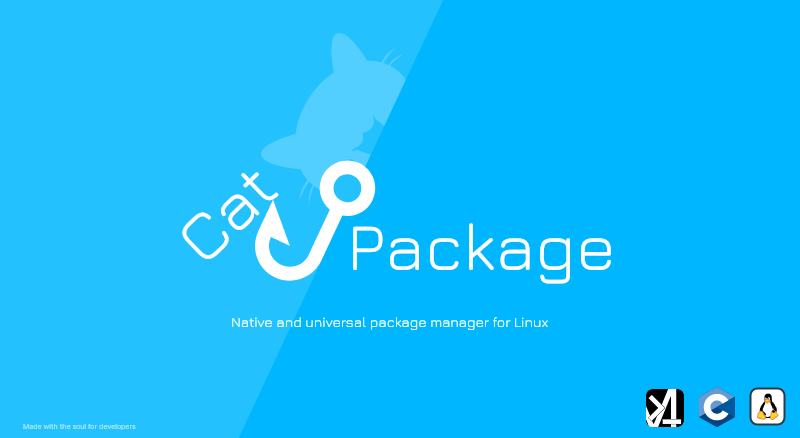

# 🌊 CatPackage 📦

---

CatPackage is a native, minimalist package manager for building a minimal OS. It is independent of the distribution and provides its own package format and bootstrap installer.

---

| About                                                                      | Briefly                                                    |
| -------------------------------------------------------------------------- | ---------------------------------------------------------- |
| **[catpkg-make](catpkg-make)**                                             | Builds catpkg packages for x86_64 and aarch64.             |
| **[catpkg-installer](catpkg-installer)**                                   | Bootstrap installer for catpkg with built-in dependencies. |
| **[catpkg](catpkg)**                                                       | Standard package manager and its commands.                 |
| **[packages-aarch64](#)**                                                  | aarch64 package repository.                                |
| **[packages-x86_64](#)**                                                   | x86_64 package repository.                                 |
| **[CATPKG Package Metadata Specification](CATPKG_METADATA_SPECIFICATION)** | Package metadata format, CATPKG 1.X and CATPKG 2.          |

## < Key Features >

* **Native C implementation.**
* **x86_64 and aarch64 support.**
* **Independent bootstrap installer.**
* **Package installation, removal, updating, verification and restoration.**
* **Own `.catpackage` package format.**
* **Designed for minimal Linux environments.**
* **CATPKG package metadata specification.**

---

## 🚀 Quick Start

### < Installation >

**Option 1 — catpkg-installer** *(Recommended)*

Download the latest installer from the [CatPackage releases](https://github.com/ModuDevCore/CatPackage/releases):

```bash
sudo ./catpkg-installer-(x86_64/aarch64)
```

**Option 2 — catpkg package**

Download the latest `.catpackage` from the [CatPackage releases](https://github.com/ModuDevCore/CatPackage/releases):

```bash
sudo catpkg install catpkg-(x86_64/aarch64)@X.X.X.catpackage
```

or:

```bash
sudo catpkg update catpkg-(x86_64/aarch64)@X.X.X.catpackage
```

**Option 3 — Build from source**

Clone the repository:

```bash
git clone https://github.com/ModuDevCore/CatPackage.git
cd CatPackage
```

Build `catpkg`:

```bash
./catpkg-make-x86_64
```

or:

```bash
./catpkg-make-aarch64
```

Then select the required build and architecture from the interactive menu.

---

## 🤝 Contributing

Contributions are welcome!

Please read **[TECHNICAL.md](./TECHNICAL.md)** before submitting a Pull Request.

---

### Acknowledgements

This project uses the [SHA-256 implementation by LekKit](https://github.com/LekKit/sha256), licensed under the MIT License.

---

**Made with ❤️ for better Linux development**
